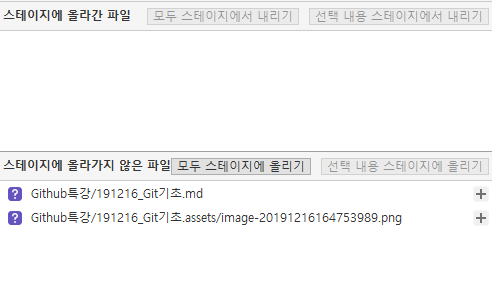

# Git 기초

## SCM이란?

Source Code Manager 의 약자로, 코드의 버젼을 관리하기 위해 존재한다.

### Git

git 은 라이너스 토르발즈가 만든 SCM 으로, 현재 가장 많이 사용된다.

### Github

github 은 git이 관리하는 Repo의 원격 저장소를 제공하는 서비스다. 가장 많이 사용하며, 오픈소스 프로젝트들이 성장하는 곳이다. 최근 MS 에 인수되었다.

## Sourcetree

## Clone

git remote repo는 다운로드가 아니라 clone을 해야 한다.